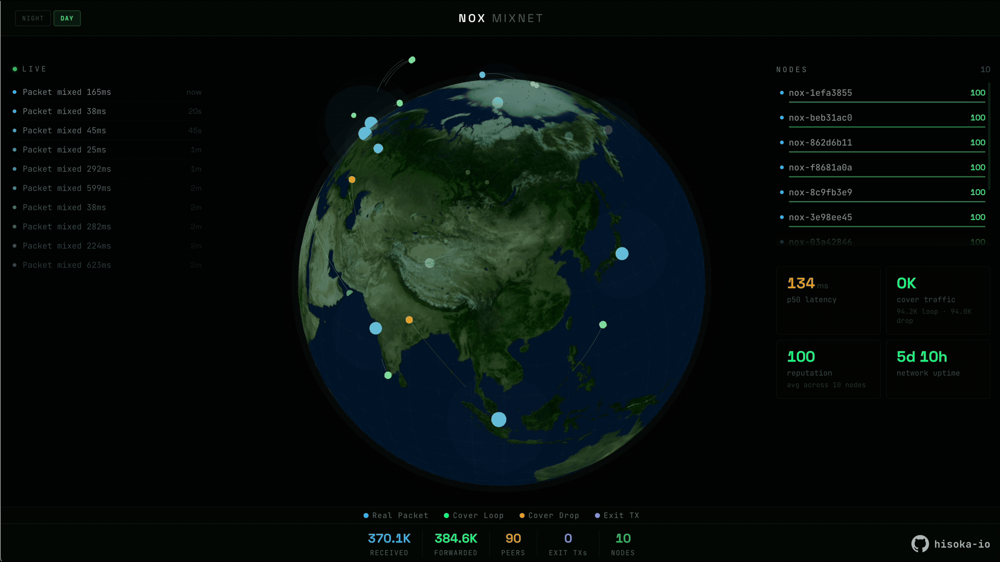

# NOX Dashboard

Real-time 3D visualization for the NOX mixnet.



## Quick Start

```bash
pnpm install
pnpm run dev
```

Mock mode (no backend): open `http://localhost:3001?mock=true`

## Scripts

- `pnpm run dev` — dev server
- `pnpm run build` — production build
- `pnpm run type-check` — typecheck
- `pnpm test` — unit tests (Node 22.6+)

## License

[MIT](LICENSE)
