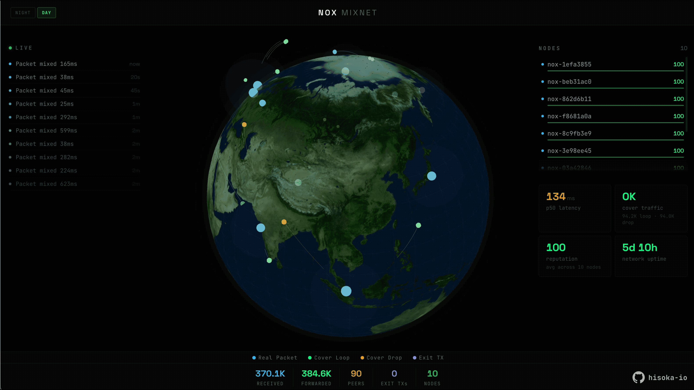

# Nox Map

Live 3D map of the Nox mixnet, served at [map.hisoka.io](https://map.hisoka.io).



## Quick Start

```bash
pnpm install
pnpm run dev
```

Mock mode (no backend): open `http://localhost:3001?mock=true`

## Data

Everything comes from a [nox-indexer](https://github.com/hisoka-io/nox-indexer):
`GET /v1/state` and `/v1/reputation` (polled every 30 s) and the `/v1/live`
WebSocket. The indexer defaults to `https://api.hisoka.io`; set
`VITE_API_BASE_URL` at build time to use another one.

- **Node positions** are a display layout: each registered node is drawn at
  its own world city, in a stable order, and the legend labels the layout.
  Global node rollout is planned, and the indexer's IP geolocation
  (`latitude`/`longitude`) stays available in its API.
- **Mix layers** are derived from each node's on-chain role and address, with
  the same rule the nodes use.
- **Arcs** are driven by growth in each node's counters (packets forwarded,
  cover traffic generated, exit payloads dispatched). Their endpoints are
  illustrative: the mixnet does not reveal real routes.
- **Chain**: the top bar shows the registry's chain from the indexer, and
  whether its node list was verified against the on-chain members.

## Scripts

- `pnpm run dev`: dev server
- `pnpm run build`: production build
- `pnpm run type-check`: typecheck
- `pnpm test`: unit tests (Node 22.6+)

## Deployment

`main` deploys to [map.hisoka.io](https://map.hisoka.io) on Railway: Railpack
builds the Vite app (`pnpm install`, `tsc && vite build`) and serves `dist/`
as a static single-page app.

## License

[MIT](LICENSE)
